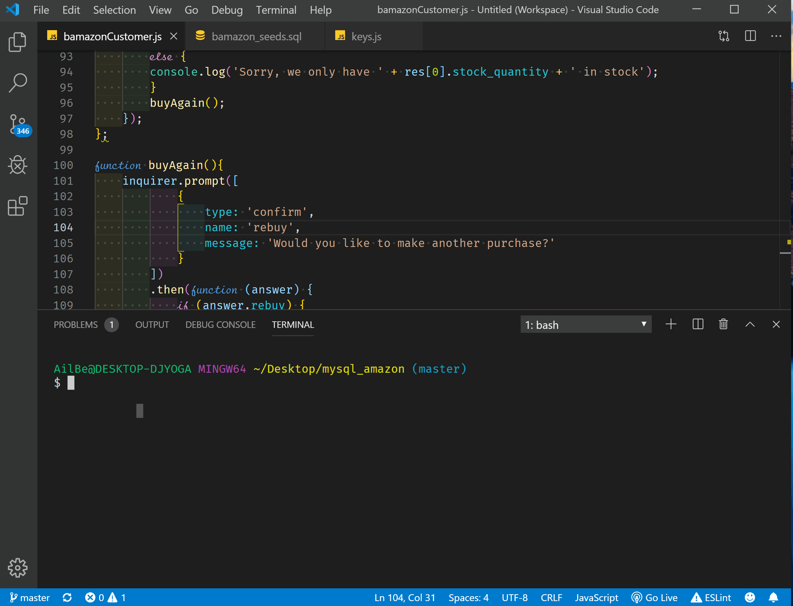
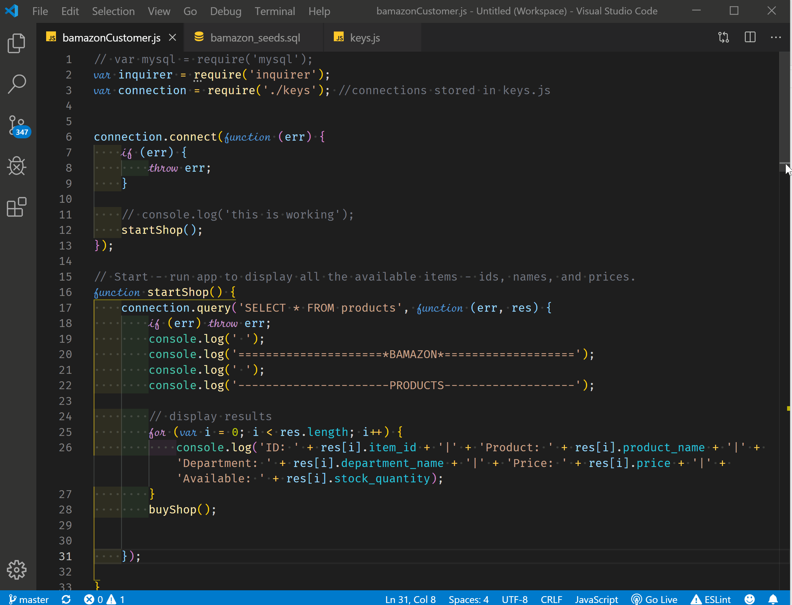

# mysql_amazon

## Overview
Create an app similar to Amazon using MYSQL database, where the user is prompted questions of what item from the available inventory they would like to purchase and how many they would like. If there is not enough in inventory, a message informing them of the insufficient quantity will be displayed and their order will not be processed. However, if there is sufficient quantity, their order will be processed and total cost will be shown. The user will then be asked if they would like to purchase anything else. If they choose to shop some more, the app will start again with the prompts, else, the app will end. 

## Screenshots

## Install
In order for the app to run, MySQL database should be installed on your computer. Clone the repo and run the code inside the MySQL client like Sequel Pro. 

## Technology Used
* MySQL
* Inquirer
* Node.js
